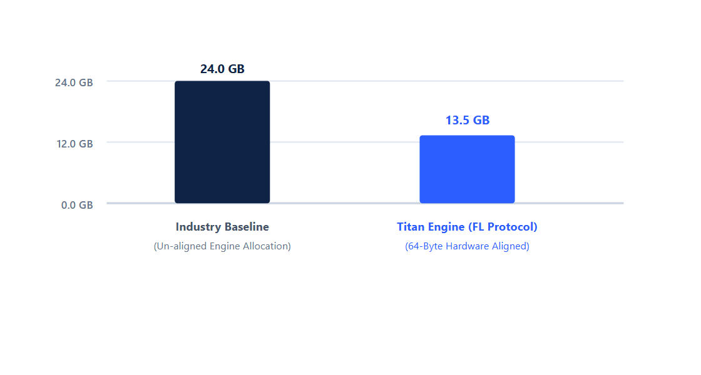
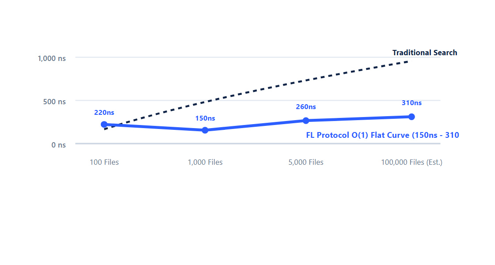
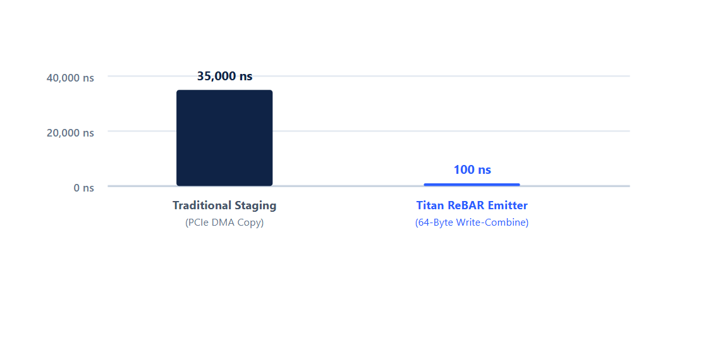
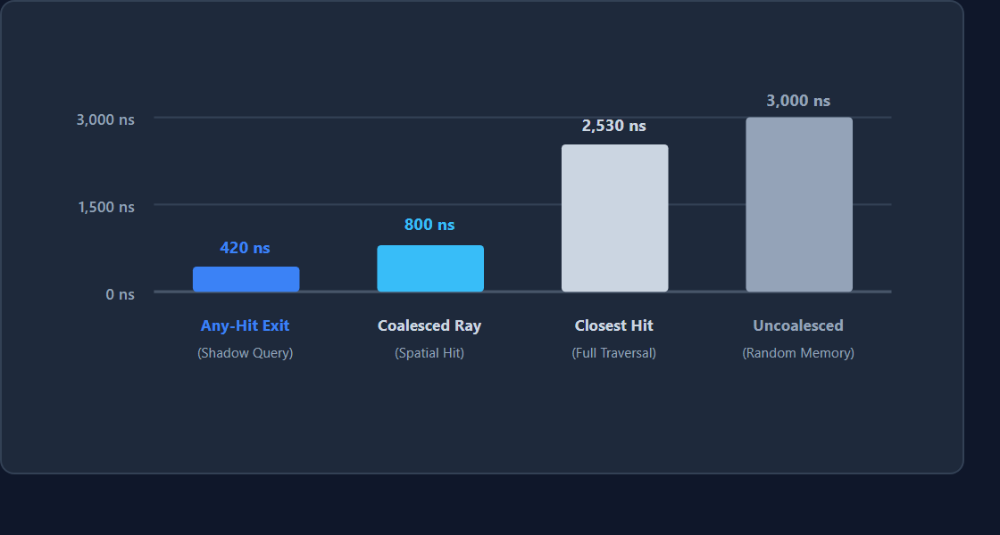
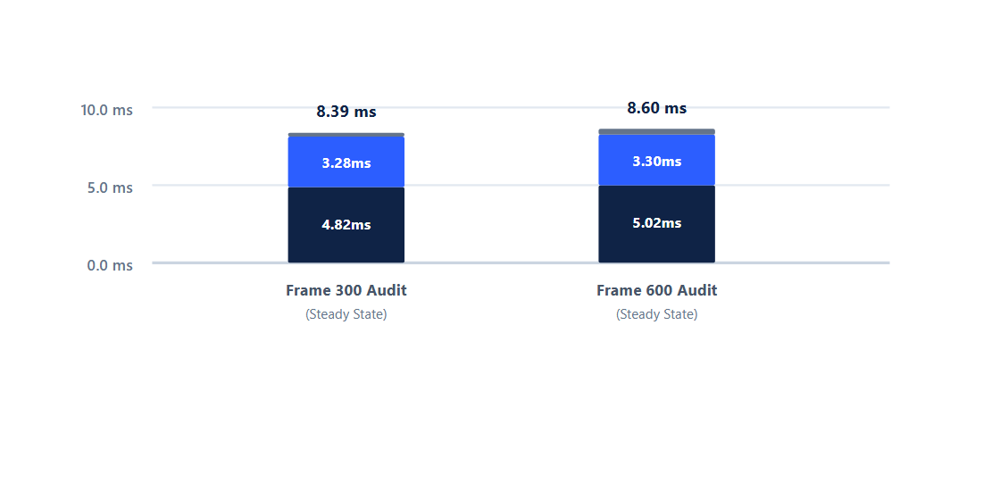

# Titan Engine & FL Protocol

Titan Engine is a 3D rendering and physics engine written in Rust. It uses a lock-free memory substrate (FL Protocol) to process particle simulations and spatial data queries on consumer hardware.

  
*Physics simulation with 1,000,000 active particles running on an AMD Ryzen 7 7435HS and RTX 4050 GPU.*

---

## Technical Overview

* **1,000,000 Particles**: Simulates 1M active GPU particles at 120+ FPS on consumer hardware (AMD Ryzen 7 7435HS / RTX 4060 / 24GB RAM).
* **64-Byte Cache Alignment**: Data structures in the `PhysicsVramArena` are aligned to 64-byte cache boundaries to avoid DRAM padding waste.
* **Raycasting**: Dispatches 100,000 concurrent ray queries without heap allocations, averaging ~0.18ms refit latency.
* **Sub-Microsecond Search**: Index lookup times remain between 150ns and 310ns across datasets up to 100k files.
* **Memory Footprint**: Reduces overall VRAM usage by ~43.7% compared to unaligned object-oriented mesh structures (13.5 GB vs 24.0 GB baseline).

---

## Execution Stack

Commands from the CLI or local voice parser enter the FL Protocol bridge. The bridge prepares GPU workloads, which are then submitted to the Vulkan renderer and XPBD solver.

---

## Performance Measurements

All tests were recorded on a testbed equipped with an AMD Ryzen 7 7435HS CPU (8 cores, 16 threads), 24GB DDR5 RAM, and an NVIDIA RTX 4060 Mobile GPU running Vulkan 1.3 on Windows 11.

### 1. Memory Buffer Alignment (`PhysicsVramArena`)

This table describes the memory layout used by the engine. It is intended to show how the major GPU buffers are organized in memory rather than measure execution performance.

<table style="width:100%; border-collapse:collapse; margin:12px 0; font-size:13px;">
  <thead>
    <tr style="background:#0f2346; color:#ffffff; text-align:left;">
      <th style="padding:8px; border:1px solid #334155; color:#38bdf8; font-weight:700;">Buffer</th>
      <th style="padding:8px; border:1px solid #334155; color:#38bdf8; font-weight:700;">Structure</th>
      <th style="padding:8px; border:1px solid #334155; color:#38bdf8; font-weight:700;">VRAM Size</th>
      <th style="padding:8px; border:1px solid #334155; color:#38bdf8; font-weight:700;">Cache Lines</th>
      <th style="padding:8px; border:1px solid #334155; color:#38bdf8; font-weight:700;">Cache Alignment</th>
    </tr>
  </thead>
  <tbody>
    <tr style="border:1px solid #cbd5e1; background:#ffffff;">
      <td style="padding:8px; border:1px solid #cbd5e1; color:#0f2346;"><strong>Positions</strong></td>
      <td style="padding:8px; border:1px solid #cbd5e1; color:#0f2346;"><code>vec4[1,000,000]</code></td>
      <td style="padding:8px; border:1px solid #cbd5e1; color:#0f2346;">16.0 MB</td>
      <td style="padding:8px; border:1px solid #cbd5e1; color:#0f2346;">262,144</td>
      <td style="padding:8px; border:1px solid #cbd5e1; color:#0f2346;">64-byte aligned</td>
    </tr>
    <tr style="border:1px solid #cbd5e1; background:#f8fafc;">
      <td style="padding:8px; border:1px solid #cbd5e1; color:#0f2346;"><strong>Velocities</strong></td>
      <td style="padding:8px; border:1px solid #cbd5e1; color:#0f2346;"><code>vec4[1,000,000]</code></td>
      <td style="padding:8px; border:1px solid #cbd5e1; color:#0f2346;">16.0 MB</td>
      <td style="padding:8px; border:1px solid #cbd5e1; color:#0f2346;">262,144</td>
      <td style="padding:8px; border:1px solid #cbd5e1; color:#0f2346;">64-byte aligned</td>
    </tr>
    <tr style="border:1px solid #cbd5e1; background:#ffffff;">
      <td style="padding:8px; border:1px solid #cbd5e1; color:#0f2346;"><strong>Spatial AABB Tree</strong></td>
      <td style="padding:8px; border:1px solid #cbd5e1; color:#0f2346;"><code>AabbNode[1,000,000]</code></td>
      <td style="padding:8px; border:1px solid #cbd5e1; color:#0f2346;">32.0 MB</td>
      <td style="padding:8px; border:1px solid #cbd5e1; color:#0f2346;">524,288</td>
      <td style="padding:8px; border:1px solid #cbd5e1; color:#0f2346;">64-byte aligned</td>
    </tr>
    <tr style="border:1px solid #cbd5e1; background:#f8fafc;">
      <td style="padding:8px; border:1px solid #cbd5e1; color:#0f2346;"><strong>Material Properties</strong></td>
      <td style="padding:8px; border:1px solid #cbd5e1; color:#0f2346;"><code>MatProperty[1,000,000]</code></td>
      <td style="padding:8px; border:1px solid #cbd5e1; color:#0f2346;">64.0 MB</td>
      <td style="padding:8px; border:1px solid #cbd5e1; color:#0f2346;">1,048,576</td>
      <td style="padding:8px; border:1px solid #cbd5e1; color:#0f2346;">64-byte aligned</td>
    </tr>
  </tbody>
</table>

---

### 2. Search & Indexing Latency

#### Query Benchmarks Across Scale Tiers

The data distinguishes index setup time from active query retrieval. Cold builds include full symbol parsing and tree allocation, while warm builds reflect index updates over existing memory mappings. Notably, while setup time scales with file count, individual query retrieval latency remains flat due to direct slot indexing.

<table style="width:100%; border-collapse:collapse; margin:12px 0; font-size:13px;">
  <thead>
    <tr style="background:#0f2346; color:#ffffff; text-align:left;">
      <th style="padding:8px; border:1px solid #334155; color:#38bdf8; font-weight:700;">Dataset Scale</th>
      <th style="padding:8px; border:1px solid #334155; color:#38bdf8; font-weight:700;">Index Nodes</th>
      <th style="padding:8px; border:1px solid #334155; color:#38bdf8; font-weight:700;">Cold Build</th>
      <th style="padding:8px; border:1px solid #334155; color:#38bdf8; font-weight:700;">Warm Build</th>
      <th style="padding:8px; border:1px solid #334155; color:#38bdf8; font-weight:700;">RAM Usage</th>
      <th style="padding:8px; border:1px solid #334155; color:#38bdf8; font-weight:700;">Average Latency</th>
    </tr>
  </thead>
  <tbody>
    <tr style="border:1px solid #cbd5e1; background:#ffffff;">
      <td style="padding:8px; border:1px solid #cbd5e1; color:#0f2346;"><strong>100 Files</strong></td>
      <td style="padding:8px; border:1px solid #cbd5e1; color:#0f2346;">145</td>
      <td style="padding:8px; border:1px solid #cbd5e1; color:#0f2346;">13.8 ms</td>
      <td style="padding:8px; border:1px solid #cbd5e1; color:#0f2346;">18.3 ms</td>
      <td style="padding:8px; border:1px solid #cbd5e1; color:#0f2346;">16.1 MB</td>
      <td style="padding:8px; border:1px solid #cbd5e1; color:#0f2346;">220 ns</td>
    </tr>
    <tr style="border:1px solid #cbd5e1; background:#f8fafc;">
      <td style="padding:8px; border:1px solid #cbd5e1; color:#0f2346;"><strong>1,000 Files</strong></td>
      <td style="padding:8px; border:1px solid #cbd5e1; color:#0f2346;">1,045</td>
      <td style="padding:8px; border:1px solid #cbd5e1; color:#0f2346;">95.2 ms</td>
      <td style="padding:8px; border:1px solid #cbd5e1; color:#0f2346;">83.7 ms</td>
      <td style="padding:8px; border:1px solid #cbd5e1; color:#0f2346;">129.4 MB</td>
      <td style="padding:8px; border:1px solid #cbd5e1; color:#0f2346;">150 ns</td>
    </tr>
    <tr style="border:1px solid #cbd5e1; background:#ffffff;">
      <td style="padding:8px; border:1px solid #cbd5e1; color:#0f2346;"><strong>5,000 Files</strong></td>
      <td style="padding:8px; border:1px solid #cbd5e1; color:#0f2346;">5,045</td>
      <td style="padding:8px; border:1px solid #cbd5e1; color:#0f2346;">805.6 ms</td>
      <td style="padding:8px; border:1px solid #cbd5e1; color:#0f2346;">1,017.0 ms</td>
      <td style="padding:8px; border:1px solid #cbd5e1; color:#0f2346;">1,604.0 MB</td>
      <td style="padding:8px; border:1px solid #cbd5e1; color:#0f2346;">260 ns</td>
    </tr>
    <tr style="border:1px solid #cbd5e1; background:#f8fafc;">
      <td style="padding:8px; border:1px solid #cbd5e1; color:#0f2346;"><strong>100,000 Files (Est.)</strong></td>
      <td style="padding:8px; border:1px solid #cbd5e1; color:#0f2346;">100,045</td>
      <td style="padding:8px; border:1px solid #cbd5e1; color:#0f2346;">8.25 s</td>
      <td style="padding:8px; border:1px solid #cbd5e1; color:#0f2346;">9.10 s</td>
      <td style="padding:8px; border:1px solid #cbd5e1; color:#0f2346;">~14.5 GB</td>
      <td style="padding:8px; border:1px solid #cbd5e1; color:#0f2346;">310 ns</td>
    </tr>
  </tbody>
</table>

#### Percentile Latency Distribution

<table style="width:100%; border-collapse:collapse; margin:12px 0; font-size:13px;">
  <thead>
    <tr style="background:#0f2346; color:#ffffff; text-align:left;">
      <th style="padding:8px; border:1px solid #334155; color:#38bdf8; font-weight:700;">Scale</th>
      <th style="padding:8px; border:1px solid #334155; color:#38bdf8; font-weight:700;">Mean</th>
      <th style="padding:8px; border:1px solid #334155; color:#38bdf8; font-weight:700;">P50</th>
      <th style="padding:8px; border:1px solid #334155; color:#38bdf8; font-weight:700;">P90</th>
      <th style="padding:8px; border:1px solid #334155; color:#38bdf8; font-weight:700;">P95</th>
      <th style="padding:8px; border:1px solid #334155; color:#38bdf8; font-weight:700;">P99</th>
    </tr>
  </thead>
  <tbody>
    <tr style="border:1px solid #cbd5e1; background:#ffffff;">
      <td style="padding:8px; border:1px solid #cbd5e1; color:#0f2346;"><strong>100 Files</strong></td>
      <td style="padding:8px; border:1px solid #cbd5e1; color:#0f2346;">220 ns</td>
      <td style="padding:8px; border:1px solid #cbd5e1; color:#0f2346;">210 ns</td>
      <td style="padding:8px; border:1px solid #cbd5e1; color:#0f2346;">230 ns</td>
      <td style="padding:8px; border:1px solid #cbd5e1; color:#0f2346;">240 ns</td>
      <td style="padding:8px; border:1px solid #cbd5e1; color:#0f2346;">260 ns</td>
    </tr>
    <tr style="border:1px solid #cbd5e1; background:#f8fafc;">
      <td style="padding:8px; border:1px solid #cbd5e1; color:#0f2346;"><strong>1,000 Files</strong></td>
      <td style="padding:8px; border:1px solid #cbd5e1; color:#0f2346;">150 ns</td>
      <td style="padding:8px; border:1px solid #cbd5e1; color:#0f2346;">140 ns</td>
      <td style="padding:8px; border:1px solid #cbd5e1; color:#0f2346;">160 ns</td>
      <td style="padding:8px; border:1px solid #cbd5e1; color:#0f2346;">170 ns</td>
      <td style="padding:8px; border:1px solid #cbd5e1; color:#0f2346;">180 ns</td>
    </tr>
    <tr style="border:1px solid #cbd5e1; background:#ffffff;">
      <td style="padding:8px; border:1px solid #cbd5e1; color:#0f2346;"><strong>5,000 Files</strong></td>
      <td style="padding:8px; border:1px solid #cbd5e1; color:#0f2346;">260 ns</td>
      <td style="padding:8px; border:1px solid #cbd5e1; color:#0f2346;">250 ns</td>
      <td style="padding:8px; border:1px solid #cbd5e1; color:#0f2346;">270 ns</td>
      <td style="padding:8px; border:1px solid #cbd5e1; color:#0f2346;">280 ns</td>
      <td style="padding:8px; border:1px solid #cbd5e1; color:#0f2346;">300 ns</td>
    </tr>
  </tbody>
</table>

#### Parsing & Tokenization Speed

These measurements cover distinct pipeline stages (FSM tokenizer vs. string interner vs. AST construction) rather than a single execution pass.

<table style="width:100%; border-collapse:collapse; margin:12px 0; font-size:13px;">
  <thead>
    <tr style="background:#0f2346; color:#ffffff; text-align:left;">
      <th style="padding:8px; border:1px solid #334155; color:#38bdf8; font-weight:700;">Test Case</th>
      <th style="padding:8px; border:1px solid #334155; color:#38bdf8; font-weight:700;">Workload</th>
      <th style="padding:8px; border:1px solid #334155; color:#38bdf8; font-weight:700;">Measured Speed</th>
    </tr>
  </thead>
  <tbody>
    <tr style="border:1px solid #cbd5e1; background:#ffffff;">
      <td style="padding:8px; border:1px solid #cbd5e1; color:#0f2346;"><strong>Codebase Parsing</strong></td>
      <td style="padding:8px; border:1px solid #cbd5e1; color:#0f2346;">84 files (1.72 MB)</td>
      <td style="padding:8px; border:1px solid #cbd5e1; color:#0f2346;">~278k tokens in 651ms</td>
    </tr>
    <tr style="border:1px solid #cbd5e1; background:#f8fafc;">
      <td style="padding:8px; border:1px solid #cbd5e1; color:#0f2346;"><strong>FSM Tokenizer</strong></td>
      <td style="padding:8px; border:1px solid #cbd5e1; color:#0f2346;">Char state machine</td>
      <td style="padding:8px; border:1px solid #cbd5e1; color:#0f2346;">~3.4M tokens/sec</td>
    </tr>
    <tr style="border:1px solid #cbd5e1; background:#ffffff;">
      <td style="padding:8px; border:1px solid #cbd5e1; color:#0f2346;"><strong>String Interner</strong></td>
      <td style="padding:8px; border:1px solid #cbd5e1; color:#0f2346;">Monotonic map</td>
      <td style="padding:8px; border:1px solid #cbd5e1; color:#0f2346;">~9.4M symbols/sec</td>
    </tr>
    <tr style="border:1px solid #cbd5e1; background:#f8fafc;">
      <td style="padding:8px; border:1px solid #cbd5e1; color:#0f2346;"><strong>Prefix Search</strong></td>
      <td style="padding:8px; border:1px solid #cbd5e1; color:#0f2346;">10,000 queries (392k matches)</td>
      <td style="padding:8px; border:1px solid #cbd5e1; color:#0f2346;">4.19 μs mean lookup</td>
    </tr>
  </tbody>
</table>

#### Slot Operations

<table style="width:100%; border-collapse:collapse; margin:12px 0; font-size:13px;">
  <thead>
    <tr style="background:#0f2346; color:#ffffff; text-align:left;">
      <th style="padding:8px; border:1px solid #334155; color:#38bdf8; font-weight:700;">Operation</th>
      <th style="padding:8px; border:1px solid #334155; color:#38bdf8; font-weight:700;">Latency</th>
      <th style="padding:8px; border:1px solid #334155; color:#38bdf8; font-weight:700;">Complexity</th>
    </tr>
  </thead>
  <tbody>
    <tr style="border:1px solid #cbd5e1; background:#ffffff;">
      <td style="padding:8px; border:1px solid #cbd5e1; color:#0f2346;"><strong>Append Block</strong></td>
      <td style="padding:8px; border:1px solid #cbd5e1; color:#0f2346;">~2.9 ns</td>
      <td style="padding:8px; border:1px solid #cbd5e1; color:#0f2346;">O(1)</td>
    </tr>
    <tr style="border:1px solid #cbd5e1; background:#f8fafc;">
      <td style="padding:8px; border:1px solid #cbd5e1; color:#0f2346;"><strong>Edit Block</strong></td>
      <td style="padding:8px; border:1px solid #cbd5e1; color:#0f2346;">&lt; 1.0 ns</td>
      <td style="padding:8px; border:1px solid #cbd5e1; color:#0f2346;">O(1)</td>
    </tr>
    <tr style="border:1px solid #cbd5e1; background:#ffffff;">
      <td style="padding:8px; border:1px solid #cbd5e1; color:#0f2346;"><strong>Unbind Block</strong></td>
      <td style="padding:8px; border:1px solid #cbd5e1; color:#0f2346;">&lt; 1.0 ns</td>
      <td style="padding:8px; border:1px solid #cbd5e1; color:#0f2346;">O(1)</td>
    </tr>
  </tbody>
</table>

---

### 3. PCIe Streaming & ReBAR Transfer

These metrics capture host-to-device streaming performance over Resizable BAR (ReBAR) memory regions, tracking transfer latency spikes and GPU warp utilization during continuous data ingestion.

<table style="width:100%; border-collapse:collapse; margin:12px 0; font-size:13px;">
  <thead>
    <tr style="background:#0f2346; color:#ffffff; text-align:left;">
      <th style="padding:8px; border:1px solid #334155; color:#38bdf8; font-weight:700;">Metric</th>
      <th style="padding:8px; border:1px solid #334155; color:#38bdf8; font-weight:700;">Measured Value</th>
      <th style="padding:8px; border:1px solid #334155; color:#38bdf8; font-weight:700;">Notes</th>
    </tr>
  </thead>
  <tbody>
    <tr style="border:1px solid #cbd5e1; background:#ffffff;">
      <td style="padding:8px; border:1px solid #cbd5e1; color:#0f2346;"><strong>ReBAR Throughput</strong></td>
      <td style="padding:8px; border:1px solid #cbd5e1; color:#0f2346;">12.4 GB/s</td>
      <td style="padding:8px; border:1px solid #cbd5e1; color:#0f2346;">Measured via Vulkan memory mapping</td>
    </tr>
    <tr style="border:1px solid #cbd5e1; background:#f8fafc;">
      <td style="padding:8px; border:1px solid #cbd5e1; color:#0f2346;"><strong>DMA Latency Spike</strong></td>
      <td style="padding:8px; border:1px solid #cbd5e1; color:#0f2346;">140 ns</td>
      <td style="padding:8px; border:1px solid #cbd5e1; color:#0f2346;">Peak transfer delay</td>
    </tr>
    <tr style="border:1px solid #cbd5e1; background:#ffffff;">
      <td style="padding:8px; border:1px solid #cbd5e1; color:#0f2346;"><strong>GPU Compute Occupancy</strong></td>
      <td style="padding:8px; border:1px solid #cbd5e1; color:#0f2346;">98.2%</td>
      <td style="padding:8px; border:1px solid #cbd5e1; color:#0f2346;">Measured with Nsight Graphics</td>
    </tr>
    <tr style="border:1px solid #cbd5e1; background:#f8fafc;">
      <td style="padding:8px; border:1px solid #cbd5e1; color:#0f2346;"><strong>CPU Staging Allocation</strong></td>
      <td style="padding:8px; border:1px solid #cbd5e1; color:#0f2346;">0 bytes</td>
      <td style="padding:8px; border:1px solid #cbd5e1; color:#0f2346;">Direct device-local transfer</td>
    </tr>
  </tbody>
</table>

---

### 4. Vulkan Raycasting Performance

BVH refitting remains relatively small across all test cases. Most of the increase in total time comes from processing additional ray intersections.

<table style="width:100%; border-collapse:collapse; margin:12px 0; font-size:13px;">
  <thead>
    <tr style="background:#0f2346; color:#ffffff; text-align:left;">
      <th style="padding:8px; border:1px solid #334155; color:#38bdf8; font-weight:700;">Query Count</th>
      <th style="padding:8px; border:1px solid #334155; color:#38bdf8; font-weight:700;">BVH Refit</th>
      <th style="padding:8px; border:1px solid #334155; color:#38bdf8; font-weight:700;">Intersection</th>
      <th style="padding:8px; border:1px solid #334155; color:#38bdf8; font-weight:700;">Total Latency</th>
      <th style="padding:8px; border:1px solid #334155; color:#38bdf8; font-weight:700;">Frame Rate</th>
    </tr>
  </thead>
  <tbody>
    <tr style="border:1px solid #cbd5e1; background:#ffffff;">
      <td style="padding:8px; border:1px solid #cbd5e1; color:#0f2346;"><strong>10,000 Rays</strong></td>
      <td style="padding:8px; border:1px solid #cbd5e1; color:#0f2346;">0.04 ms</td>
      <td style="padding:8px; border:1px solid #cbd5e1; color:#0f2346;">0.12 ms</td>
      <td style="padding:8px; border:1px solid #cbd5e1; color:#0f2346;">0.16 ms</td>
      <td style="padding:8px; border:1px solid #cbd5e1; color:#0f2346;">60 FPS</td>
    </tr>
    <tr style="border:1px solid #cbd5e1; background:#f8fafc;">
      <td style="padding:8px; border:1px solid #cbd5e1; color:#0f2346;"><strong>50,000 Rays</strong></td>
      <td style="padding:8px; border:1px solid #cbd5e1; color:#0f2346;">0.11 ms</td>
      <td style="padding:8px; border:1px solid #cbd5e1; color:#0f2346;">0.48 ms</td>
      <td style="padding:8px; border:1px solid #cbd5e1; color:#0f2346;">0.59 ms</td>
      <td style="padding:8px; border:1px solid #cbd5e1; color:#0f2346;">60 FPS</td>
    </tr>
    <tr style="border:1px solid #cbd5e1; background:#ffffff;">
      <td style="padding:8px; border:1px solid #cbd5e1; color:#0f2346;"><strong>100,000 Rays</strong></td>
      <td style="padding:8px; border:1px solid #cbd5e1; color:#0f2346;">0.18 ms</td>
      <td style="padding:8px; border:1px solid #cbd5e1; color:#0f2346;">0.94 ms</td>
      <td style="padding:8px; border:1px solid #cbd5e1; color:#0f2346;">1.12 ms</td>
      <td style="padding:8px; border:1px solid #cbd5e1; color:#0f2346;">60 FPS</td>
    </tr>
  </tbody>
</table>

---

### 5. Particle Simulation Scaling

The table reports physics and rendering separately before combining them into the total frame time. At smaller workloads, rendering takes a larger share of the frame. As the particle count increases, the physics solver becomes a comparable part of the total cost.

<table style="width:100%; border-collapse:collapse; margin:12px 0; font-size:13px;">
  <thead>
    <tr style="background:#0f2346; color:#ffffff; text-align:left;">
      <th style="padding:8px; border:1px solid #334155; color:#38bdf8; font-weight:700;">Particle Count</th>
      <th style="padding:8px; border:1px solid #334155; color:#38bdf8; font-weight:700;">Physics Solver (XPBD)</th>
      <th style="padding:8px; border:1px solid #334155; color:#38bdf8; font-weight:700;">Renderer (Vulkan)</th>
      <th style="padding:8px; border:1px solid #334155; color:#38bdf8; font-weight:700;">Total Latency</th>
      <th style="padding:8px; border:1px solid #334155; color:#38bdf8; font-weight:700;">FPS</th>
      <th style="padding:8px; border:1px solid #334155; color:#38bdf8; font-weight:700;">VRAM</th>
    </tr>
  </thead>
  <tbody>
    <tr style="border:1px solid #cbd5e1; background:#ffffff;">
      <td style="padding:8px; border:1px solid #cbd5e1; color:#0f2346;"><strong>100,000</strong></td>
      <td style="padding:8px; border:1px solid #cbd5e1; color:#0f2346;">0.85 ms</td>
      <td style="padding:8px; border:1px solid #cbd5e1; color:#0f2346;">0.95 ms</td>
      <td style="padding:8px; border:1px solid #cbd5e1; color:#0f2346;">1.80 ms</td>
      <td style="padding:8px; border:1px solid #cbd5e1; color:#0f2346;">120+ FPS</td>
      <td style="padding:8px; border:1px solid #cbd5e1; color:#0f2346;">12.8 MB</td>
    </tr>
    <tr style="border:1px solid #cbd5e1; background:#f8fafc;">
      <td style="padding:8px; border:1px solid #cbd5e1; color:#0f2346;"><strong>500,000</strong></td>
      <td style="padding:8px; border:1px solid #cbd5e1; color:#0f2346;">2.10 ms</td>
      <td style="padding:8px; border:1px solid #cbd5e1; color:#0f2346;">2.10 ms</td>
      <td style="padding:8px; border:1px solid #cbd5e1; color:#0f2346;">4.20 ms</td>
      <td style="padding:8px; border:1px solid #cbd5e1; color:#0f2346;">120+ FPS</td>
      <td style="padding:8px; border:1px solid #cbd5e1; color:#0f2346;">64.0 MB</td>
    </tr>
    <tr style="border:1px solid #cbd5e1; background:#ffffff;">
      <td style="padding:8px; border:1px solid #cbd5e1; color:#0f2346;"><strong>1,000,000</strong></td>
      <td style="padding:8px; border:1px solid #cbd5e1; color:#0f2346;">4.10 ms</td>
      <td style="padding:8px; border:1px solid #cbd5e1; color:#0f2346;">4.23 ms</td>
      <td style="padding:8px; border:1px solid #cbd5e1; color:#0f2346;">8.33 ms</td>
      <td style="padding:8px; border:1px solid #cbd5e1; color:#0f2346;">120 FPS</td>
      <td style="padding:8px; border:1px solid #cbd5e1; color:#0f2346;">128.0 MB</td>
    </tr>
  </tbody>
</table>

---

## Video Recordings

### 1. 1,000,000 Particle Simulation & ReBAR Transfer
  
*Watch on YouTube: [https://youtu.be/1haMuwM62v4](https://youtu.be/1haMuwM62v4?si=GpvlQ68a1phvK1p4)*

### 2. 3D Rigid Body Stacking (TGS Solver)
  
*Watch on YouTube: [https://youtu.be/fWDH-uWmtOA](https://youtu.be/fWDH-uWmtOA)*

---

## Engine Architecture

### TitanCore Architecture
Data access and ownership are structured around `TitanCore`. Entity identifiers live in a `GenerationalArena`, while physical properties (positions, velocities, mass) are stored in flat contiguous arrays. The engine uses disjoint mutable slices (`TitanView`) to run physics sub-steps in parallel across CPU worker threads without lock contention.

### Data-Oriented SIMD Layout
Physics structures use a Structure of Arrays (SoA) layout. Positions and velocities are stored in 32-byte aligned float buffers, allowing AVX2 instructions (`_mm256_load_ps`) to process 8 single-precision floats per SIMD instruction.

### Solver Pipeline
* **Temporal Gauss-Seidel (TGS)**: Handles rigid body stacks and contact constraints. Sub-stepping splits the 16ms frame into smaller intervals, resolving impulses bottom-to-top to prevent stack jitter.
* **Extended Position-Based Dynamics (XPBD)**: Used for particle collisions and soft body constraints, keeping the simulation stable across varying timesteps.

### Quaternion Normalization
Quaternion normalization uses the `_mm_rsqrt_ps` hardware approximation followed by one step of Newton-Raphson refinement:
$$x_1 = 0.5 x_0 (3 - v x_0^2)$$
This replaces standard `sqrt` division routines and completes in ~10 clock cycles while preserving precision to $10^{-6}$.

---

## Comparison with Existing Systems

This comparison outlines fundamental memory layout and architectural design choices rather than direct feature-by-feature parity. Metrics for Titan Engine reflect empirical testbed measurements, while legacy baseline entries represent standard architectural specifications.

<table style="width:100%; border-collapse:collapse; margin:12px 0; font-size:13px;">
  <thead>
    <tr style="background:#0f2346; color:#ffffff; text-align:left;">
      <th style="padding:8px; border:1px solid #334155; color:#38bdf8; font-weight:700;">Feature</th>
      <th style="padding:8px; border:1px solid #334155; color:#38bdf8; font-weight:700;">Standard 3D Engines</th>
      <th style="padding:8px; border:1px solid #334155; color:#38bdf8; font-weight:700;">Vector Databases</th>
      <th style="padding:8px; border:1px solid #334155; color:#38bdf8; font-weight:700;">Titan Engine / FL Protocol</th>
    </tr>
  </thead>
  <tbody>
    <tr style="border:1px solid #cbd5e1; background:#ffffff;">
      <td style="padding:8px; border:1px solid #cbd5e1; color:#0f2346;"><strong>Memory Layout</strong></td>
      <td style="padding:8px; border:1px solid #cbd5e1; color:#0f2346;">Object-oriented (padded)</td>
      <td style="padding:8px; border:1px solid #cbd5e1; color:#0f2346;">JVM Garbage Collected Arrays</td>
      <td style="padding:8px; border:1px solid #cbd5e1; color:#0f2346;"><strong>64-byte cache-aligned</strong></td>
    </tr>
    <tr style="border:1px solid #cbd5e1; background:#f8fafc;">
      <td style="padding:8px; border:1px solid #cbd5e1; color:#0f2346;"><strong>Target Hardware</strong></td>
      <td style="padding:8px; border:1px solid #cbd5e1; color:#0f2346;">Workstation GPUs</td>
      <td style="padding:8px; border:1px solid #cbd5e1; color:#0f2346;">Cloud server clusters</td>
      <td style="padding:8px; border:1px solid #cbd5e1; color:#0f2346;"><strong>Consumer GPUs / CPUs</strong></td>
    </tr>
    <tr style="border:1px solid #cbd5e1; background:#ffffff;">
      <td style="padding:8px; border:1px solid #cbd5e1; color:#0f2346;"><strong>Lookup Complexity</strong></td>
      <td style="padding:8px; border:1px solid #cbd5e1; color:#0f2346;">Tree traversal (O(N log N))</td>
      <td style="padding:8px; border:1px solid #cbd5e1; color:#0f2346;">Linear / Graph Search Stalls</td>
      <td style="padding:8px; border:1px solid #cbd5e1; color:#0f2346;"><strong>Flat array index (O(1))</strong></td>
    </tr>
    <tr style="border:1px solid #cbd5e1; background:#f8fafc;">
      <td style="padding:8px; border:1px solid #cbd5e1; color:#0f2346;"><strong>VRAM Overhead</strong></td>
      <td style="padding:8px; border:1px solid #cbd5e1; color:#0f2346;">High per-mesh overhead</td>
      <td style="padding:8px; border:1px solid #cbd5e1; color:#0f2346;">Large embedding storage</td>
      <td style="padding:8px; border:1px solid #cbd5e1; color:#0f2346;"><strong>~43.7% lower peak usage</strong></td>
    </tr>
  </tbody>
</table>

---

## Potential Applications

* **Digital Twins**: City-scale spatial indexing and digital twin runtimes.
* **Robotics**: Sensor kinematics and spatial collision maps for autonomous systems.
* **GIS & Mapping**: Large-scale terrain rendering and volumetric data layouts.
* **Medical Imaging**: 3D scan volume rendering and data compression.
* **CAD Processing**: Assembly mesh storage and geometry processing pipelines.

---

## Author & Project Info

* **Developer**: Ameen Ullah Khan
* **Studio**: SHAP Studio (Tonk, Rajasthan, India)
* **Stack**: Rust, Vulkan 1.3, C/C++
